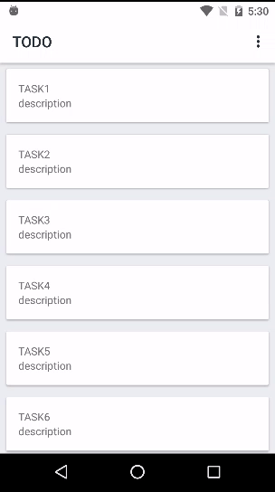

# TODO APP
* Kotlin
* MVVM
* [Architecture Components](https://developer.android.com/topic/libraries/architecture/viewmodel.html)
* [ItemTouchHelper](https://developer.android.com/reference/android/support/v7/widget/helper/ItemTouchHelper.SimpleCallback.html)   

## Prerequisites
* Android SDK 25
* Android Build Tool 25.0.2
* Android Support Library 25.4.0
* Android Plugin for Gradle 3.0.0-alpha5
* Kotlin v1.1.3

## Getting Started
Build with Android Studio 3.0
